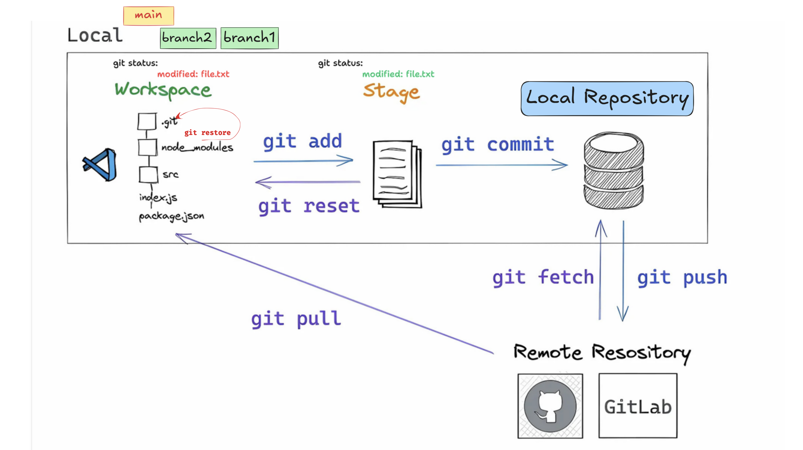
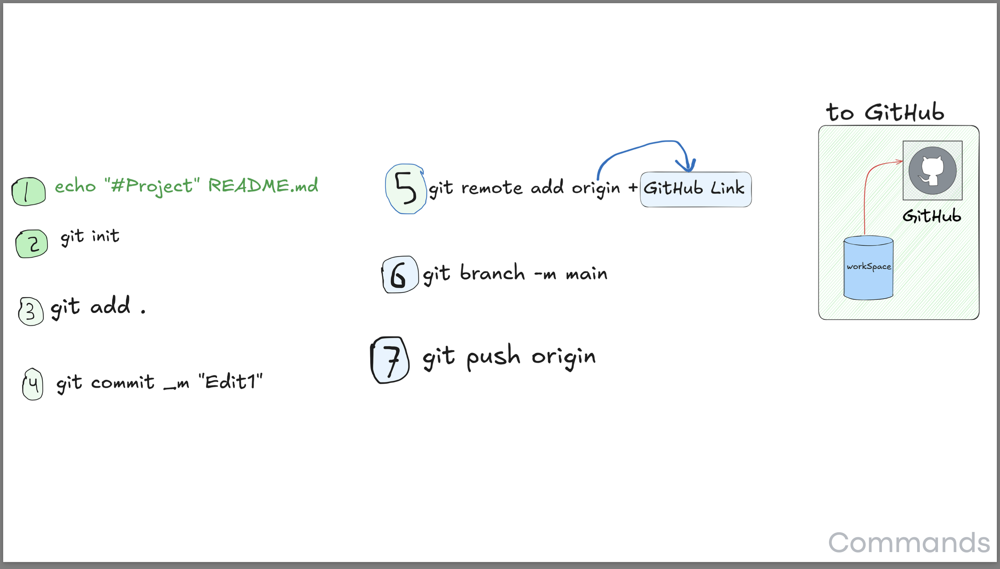
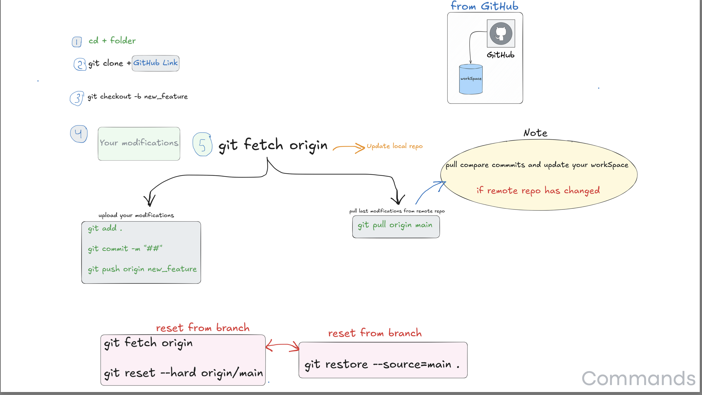

# 🚀 Git and GitHub Commands Essentials for Beginners 💡

Welcome! This is a quick visual guide to the most important basic Git commands, designed to **simplify your understanding** of the Git workflow and how to interact with GitHub.

---

## 1. 🔄 The Git Workflow: Local and Remote

### Stages and Key Commands Explained:

| Stage | Description | Key Commands |
| :--- | :--- | :--- |
| **Workspace (Working Directory)** | Where you write and modify your files on your local machine. | `git restore <file>`: Discards changes in a file, reverting to its last Staged or Committed state. |
| **Stage (Index)** | A temporary area where you select and gather changes you want to include in your next **Commit**. | `git add <file>` or `git add .`: Adds modified files from the **Workspace** to the **Stage**. |
| **Local Repository** | A database on your machine that stores all your **Commits** and the complete history of your project. | `git commit -m "Message"`: Permanently saves the staged changes into the **Local Repository**. |
| **Remote Repository** | A copy of your project hosted online (e.g., **GitHub** or **GitLab**) for collaboration and backup. | `git push`: Sends your local **Commits** to the Remote Repository. `git fetch`: Downloads new changes from the Remote Repository *without* integrating them. `git pull`: Fetches and merges new changes from the Remote Repository. |

---

## 2. ⬆️ Pushing a New Project to GitHub

These steps guide you on how to **initialize** your local project and connect it to a new repository on GitHub for the **first time**.

### Step-by-Step Commands:

1. `echo "#Project" > README.md` – *(Optional)* Creates a basic `README.md` file.  
2. `git init` – **Initializes** your project folder as a local Git repository.  
3. `git add .` – **Stages** all current project files for the next commit.  
4. `git commit -m "Edit1"` – **Commits** the staged changes as the first save point.  
5. `git remote add origin <GitHub Link>` – **Connects** your local repository to the remote one on GitHub.  
6. `git branch -M main` – **Renames** the current branch to `main`.  
7. `git push origin main` – **Uploads** all local commits to the remote repository (`origin`).  

---

## 3. ⬇️ Cloning, Updating, and Modifying from GitHub

#### 1. Clone the Project (First Time):

1.  `cd <folder>`: Navigate to the directory where you want to save the project.
2.  `git clone <GitHub Link>`: **Copies** the entire project from GitHub to your local machine.

#### 2. Make Modifications and Synchronize:

3.  `git checkout new_feature`: **Switches** to or **creates** a new branch to work on a feature.
4.  **Your modifications**: Start editing the project files.
5.  `git fetch origin`: **Update local repo**. Fetches new commits from the remote repository (e.g., changes made by teammates).
    * **Note**: If the remote repo has changed and you want to integrate immediately:
        * `git pull origin main`: **Pulls** and **merges** changes from the remote `main` branch into your current local branch.

#### 3. Upload Your Changes:

* `git add .`: Stage your modifications.
* `git commit -m "##"`: Save your staged changes as a new commit.
* `git push origin new_feature`: **Upload** your new commits to your dedicated branch on the Remote Repository.

---

## ⚠️ Undoing Changes (Reset & Restore)

If you make a mistake or need to revert changes, here are two critical recovery commands:

| Command | Description |
| :--- | :--- |
| `git fetch origin` then `git reset --hard origin/main` | **Hard Reset**: Deletes all uncommitted local changes, making your local branch exactly match the last state of the remote branch (`origin/main`). **Use with extreme caution!** |
| `git restore --source=main .` | **Selective Restore**: Reverts all files in the current directory (`.`) back to the state of a specified branch (`main`). Used to discard changes in the Workspace. |

---

